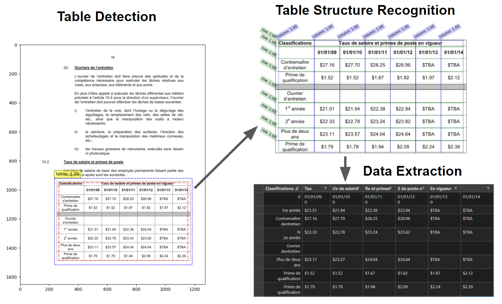

# Table Extraction with Machine Learning
> Report of this project is posted in 
> [_Medium_](https://johnfengphd.medium.com/table-extraction-with-pre-trained-ml-model-f638dfd4bdb7). <!-- If you have the project hosted somewhere, include the link here. -->

## Introduction

Table extraction from documents using machine learning involves training algorithms to automatically identify and extract tables from a given document. This process can be challenging, as tables can come in various formats and layouts, and may be embedded within larger documents such as research papers, reports, or financial statements. The successful implementation of ML-based table extraction can save significant time and resources compared to manual extraction methods, especially for large or complex documents with multiple tables. However, the accuracy of table extraction can be affected by factors such as the quality and consistency of input data, as well as the complexity of the document layout.

A very accurate model has been developed by a team at Microsoft [1]. They trained their DETR (End-to-end Object Detection with Transformers) -based model on a very large dataset of approximately 1 million annotated tables. The original tables were scraped from the PubMed Central Open Access (PMCAO) database. The Microsoft team also formulated their own scoring criteria, Grid Table Similarity (GriTS), for assessing the accuracy of their model [2].

<!-- ## Technologies Used
- Tech 1 - version 1.0
- Tech 2 - version 2.0
- Tech 3 - version 3.0

## Features
List the ready features here:
- Awesome feature 1
- Awesome feature 2
- Awesome feature 3 -->

<!-- If you have screenshots you'd like to share, include them here. -->

## How to use
First, clone the repo into your local machine. 
`git clone https://github.com/johnnykfeng/sigtica-table-extraction.git`

I recommend you create a virtual python environment with Python versions 3.7 - 3.9 (for PyTorch compatibility). I typically do this on VS-Code by typing this on the terminal. 
`python3.9 -m venv venv`

Install all the necessary Python packages into your new Python environment. 
`pip install -r requirements.txt`

Get your own Google Cloud Vision API key as a .json file. 
Here's a tutorial: https://www.youtube.com/watch?v=TTeVtJNWdmI

Test the code by running `run_TableExtractor.py` or equivalent `.ipynb` file. It should apply the Table Extractor on the sample images provided in this repo.

## Project Status
This project is now useable. Any changes or improvements shoud be made in a separate branch.

## Future developments:
- Figure out how to run table extraction in parallel
- Implement header structures properly into dataframe
- Further training the model via transfer learning
- Deploying this model onto a web app

## Resources
- This project is made possible with https://github.com/microsoft/table-transformer
- Hugging face for making it accessible https://huggingface.co/docs/transformers/model_doc/table-transformer
- Google Cloud Vision for providing the powerful OCR https://cloud.google.com/vision

## Contact
Created by John Feng.  
Feel free to contact me at johnfengphd@gmail.com.

<!-- Optional -->
<!-- ## License -->
<!-- This project is open source and available under the [... License](). -->

<!-- You don't have to include all sections - just the one's relevant to your project -->

[def]: #contact